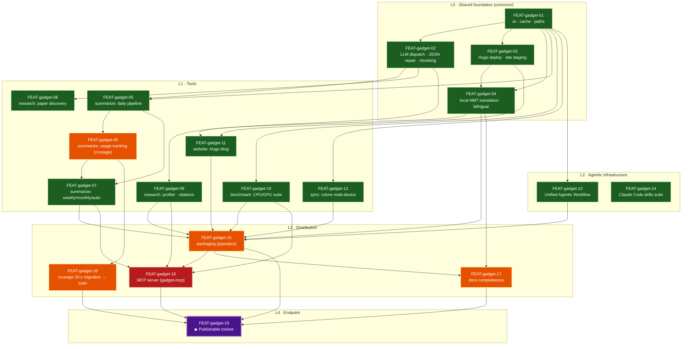
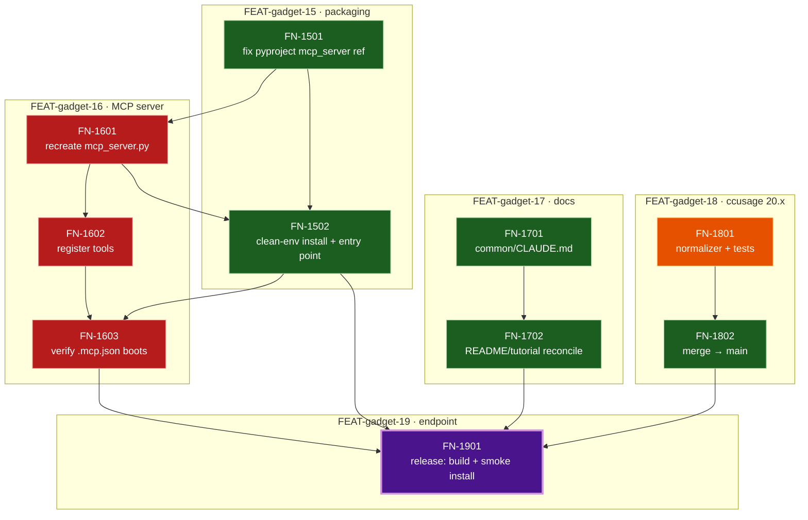

# gadget — Feature/Task Dependency DAG

Human-readable render of [`gadget.ecl.yaml`](./gadget.ecl.yaml) — the two-level map of
the whole `gadget` toolkit in AI Dev Companion ECL form. It answers two questions you
can't easily recover cold: **what does this repo build, and where did I leave off?**

> **Keep in sync:** the Mermaid edges below are hand-authored to match the YAML's
> `dependency_graph` exactly. Change one, change the other (no generator script by design).

## How to read this

- **Nodes** are milestones (FEAT, coarse deliverables) or tasks (FN, from-scratch steps).
  Each is documented with the AI Companion **5 questions** —
  `what` (是什么) · `why` (为什么做) · `how` (如何做) · `why_this_way` (为什么这样做) ·
  `expected` (期望结果) — in the records lower in this file.
- **Edges** are **prerequisites** — `A --> B` means B is built on / consumes A.
- The graph flows from the **shared foundation** (`common/`) up through the tools to the
  single terminal deliverable **FEAT-gadget-19 — a publishable toolset**.
- Node color = status. **Click any node** to jump to its 5-question record below.
  (Mermaid node-clicks work in VS Code preview / Mermaid Live / Obsidian; GitHub disables
  them — use the [Node index](#node-index) as a fallback there.)

## The DAG

**Legend:** 🟩 done · 🟧 in-progress · 🟥 blocked · 🟪 terminal (endpoint)

## Where you left off → next actions

The frontier = pending/in-progress nodes whose prerequisites are satisfied. Active branch:
`fix/ccusage-20-migration`.

| Node | Status | Do next | Blocked by |
|------|--------|---------|------------|
| [FEAT-gadget-18](#feat-gadget-18) ccusage 20.x | 🟧 in-progress | [FN-1801](#fn-gadget-1801) finalize per-source normalizer + tests → [FN-1802](#fn-gadget-1802) merge to main | — (this is the active branch) |
| [FEAT-gadget-15](#feat-gadget-15) packaging | 🟧 in-progress | [FN-1501](#fn-gadget-1501) remove/replace the dead `mcp_server` entry in pyproject | coupled to MCP restore |
| [FEAT-gadget-16](#feat-gadget-16) MCP server | 🟥 blocked | [FN-1601](#fn-gadget-1601) recreate `mcp_server.py` with `main()` | `mcp_server.py` deleted, exists nowhere |
| [FEAT-gadget-17](#feat-gadget-17) docs | 🟧 in-progress | [FN-1701](#fn-gadget-1701) add `common/CLAUDE.md` (audit F-003) | — |
| [FEAT-gadget-19](#feat-gadget-19) ◆ publishable | 🟪 pending | [FN-1901](#fn-gadget-1901) release: bump + build + clean-env smoke install | 15 · 16 · 17 · 18 |

## Open frontier (task-level zoom)

Only the unfinished milestones are decomposed into from-scratch tasks. Click a node to jump
to its record.

> Pending tasks are drawn green-bordered only to read as "not yet blocked"; status text in
> each record is authoritative. `T1901` is styled terminal (the endpoint task).

## Node index

GitHub disables Mermaid node-clicks; these plain links do the same jumps.

**Milestones:**
[01](#feat-gadget-01) ·
[02](#feat-gadget-02) ·
[03](#feat-gadget-03) ·
[04](#feat-gadget-04) ·
[05](#feat-gadget-05) ·
[06](#feat-gadget-06) ·
[07](#feat-gadget-07) ·
[08](#feat-gadget-08) ·
[09](#feat-gadget-09) ·
[10](#feat-gadget-10) ·
[11](#feat-gadget-11) ·
[12](#feat-gadget-12) ·
[13](#feat-gadget-13) ·
[14](#feat-gadget-14) ·
[15](#feat-gadget-15) ·
[16](#feat-gadget-16) ·
[17](#feat-gadget-17) ·
[18](#feat-gadget-18) ·
[19 ◆](#feat-gadget-19)

**Tasks:**
[1801](#fn-gadget-1801) ·
[1802](#fn-gadget-1802) ·
[1501](#fn-gadget-1501) ·
[1502](#fn-gadget-1502) ·
[1601](#fn-gadget-1601) ·
[1602](#fn-gadget-1602) ·
[1603](#fn-gadget-1603) ·
[1701](#fn-gadget-1701) ·
[1702](#fn-gadget-1702) ·
[1901](#fn-gadget-1901)

---

## Milestone records (5 questions)

### FEAT-gadget-01 — common: io · cache · paths · `done`
- **是什么 / what** — Crash-safe `atomic_write`, SHA-256 content hashing, tolerant JSON config loading, a namespaced `DiskCache` with TTL, and the canonical `outputs/` path constants.
- **为什么做 / why** — Every tool needs corruption-free writes, result caching, and a cwd-independent agreement on where output lives.
- **如何做 / how** — `common/io.py` (mkstemp + `os.replace`), `common/cache.py` (content-hash keys, lazy namespaces), `common/paths.py` (`GADGET_ROOT = parent.parent`, no mkdir side-effects).
- **为什么这样做 / why_this_way** — One source of truth, no DB; atomic temp-then-rename is the cheapest crash safety; bare path constants keep importing `common/` free.
- **期望结果 / expected** — Tools import these instead of rolling their own; no partial files; cache hits avoid repeat cost.

### FEAT-gadget-02 — common: LLM dispatch + JSON repair + chunking · `done`
- **what** — Backend-agnostic LLM layer (Claude CLI / Anthropic / OpenAI via one `--api`), staged JSON parse+repair, and char-bounded chunking with hierarchical merge.
- **why** — Switch providers without duplicating SDK/subprocess plumbing; survive malformed JSON and over-context inputs.
- **how** — `common/llm.py` (`call_llm`/`call_llm_raw`, `LLMCallConfig`, `chunk_text`/`timed_llm_call`/`hierarchical_merge`), `common/json_utils.py` (4-stage parse + optional LLM repair).
- **why_this_way** — else-defaults-to-`claude_cli` keeps the no-key path alive; lazy SDK imports avoid hard deps; JSON repair is cheap-first, escalating to an LLM only on a surviving `parse_error`.
- **expected** — Callers always get a dict; one flag swaps providers; 150K-char inputs summarize without truncation loss.

### FEAT-gadget-03 — common: Hugo deploy + site staging · `done`
- **what** — Cross-platform `run_hugo_update` + helpers that stage generated content/static under `outputs/site` before merging into the tracked Hugo tree.
- **why** — summarize/research/benchmark publish to the blog and must not write into the tracked content tree.
- **how** — `common/hugo.py` (Windows `update.ps1` → `update.sh` via Git Bash; UNIX `update.sh`), `common/site_staging.py` (staging beside the site, atomic writes, static copy).
- **why_this_way** — Stage-then-merge keeps generated output out of version control until deploy; platform detection avoids a hard shell dependency.
- **expected** — Any tool deploys bilingual reports with one call; generated files never pollute the tracked tree pre-deploy.

### FEAT-gadget-04 — common: local NMT translation + bilingual · `done`
- **what** — Pluggable local translation engine (vLLM / transformers / llama-cpp GGUF) behind one ABC, a fragment-protecting markdown translator, and `write_bilingual()` emitting `.md`/`.zh.md` pairs.
- **why** — Produce all bilingual site content offline (no API cost) without corrupting code, URLs, shortcodes, or proper nouns.
- **how** — `common/engine.py` (`create_engine` factory, platform auto-select, warm `_CachedEngineProxy`), `common/translation.py` (frontmatter split, placeholder protection, chunked batch, validation), `common/bilingual.py`. Default `tencent/HY-MT1.5-1.8B`.
- **why_this_way** — Local inference removes per-token cost at site scale; a warm cached engine amortizes model load; validation rejects garbage/truncation before publish.
- **expected** — Every report/page ships EN+ZH; the source-language file is always written even if translation fails.

### FEAT-gadget-05 — summarize: daily pipeline · `done`
- **what** — Two-phase daily summarizer: per-device export of Claude Code / Codex / ChatGPT / generic logs → multi-device merge → LLM structured report → Markdown+JSON+chart → bilingual Hugo deploy.
- **why** — Turn a day's scattered multi-device AI interactions into one authoritative, importance-graded daily report.
- **how** — `summarize/daily.py`, `parsers.py` (4 source parsers → common schema), `summarizer.py` (chunk + Anthropic tool-use schema + hierarchical merge), `formatter.py`. CLI `python -m summarize daily`.
- **why_this_way** — Export/merge split supports a multi-device workflow; tool-use schema enforces consistent importance grading.
- **expected** — `summarize daily merge --sync-all` yields a finalized bilingual daily report per date with token charts.

### FEAT-gadget-06 — summarize: usage tracking (ccusage) · `in-progress`
- **what** — Fetch + normalize + snapshot per-device token/cost usage from ccusage (Claude Code) and per-source CLIs (codex, gemini, …), load per-date, merge across devices.
- **why** — Reports must carry accurate per-model/device/source token counts and USD cost across all agent CLIs.
- **how** — `summarize/usage.py` — `fetch_ccusage_full` / `fetch_codex_usage_full`, per-source normalizer, snapshot envelopes, `_merge_token_usages`. **Active 20.x migration**: discover sources via `metadata.agents`, run per-source namespaced commands.
- **why_this_way** — ccusage 20.x replaced `@ccusage/codex` with unified per-source commands; per-source snapshots keep aggregation source-agnostic.
- **expected** — All agent-CLI usage discovered, normalized, and rendered identically in every report tier.

### FEAT-gadget-07 — summarize: aggregation & automation · `done`
- **what** — ISO-week and month roll-ups over daily JSONs (LLM digest + mechanical token aggregation across sources), a one-click `auto` orchestrator, and matplotlib charts.
- **why** — Roll dailies into weekly/monthly digests with cumulative cost trends in one command.
- **how** — `weekly_summary.py` + `monthly_summary.py` (source-hash caches, `submit_*_report` schemas), `auto.py` (subprocess orchestration), `charts.py` (N-source PNG).
- **why_this_way** — weekly imports aggregation helpers from monthly (one implementation); `auto` shells out so each tier stays independently runnable.
- **expected** — `summarize auto --deploy` produces+deploys daily/weekly/monthly bilingual reports with multi-source charts.

### FEAT-gadget-08 — research: paper discovery (Scout) · `done`
- **what** — Search arXiv / bioRxiv / PubMed, three-stage LLM evaluation (screen → deep → citation impact), NL `ask` routing, conference/author search, bilingual Hugo deploy.
- **why** — Turn a research interest into a curated, evaluated daily paper report.
- **how** — `research/scout/` package (+ `research_scout.py` shim), `research/apis/` (semantic_scholar, openreview), insight engine for full-text + OpenReview.
- **why_this_way** — Modular `scout/` with a thin shim preserves the historic entry point; three-stage evaluation spends LLM budget only on survivors.
- **expected** — `research_scout.py report --project X` yields a deployable evaluated report; `ask` auto-routes source.

### FEAT-gadget-09 — research: profiler & citation graph · `done`
- **what** — Researcher profiling (ArXiv + Semantic Scholar → LLM trajectory, tier scoring, homepage/coauthor student discovery, namesake disambiguation) + forward/backward citation analysis with LLM impact reads.
- **why** — Profile a researcher or trace a paper's citation influence as a first-class workflow.
- **how** — `research/` profiler package (`analysis.py`, `scoring.py`, `homepage_discovery.py`); citations via Semantic Scholar; entries `profile` / `citations` / `python -m research`.
- **why_this_way** — Reuses shared research APIs + common LLM/cache; affiliation disambiguation avoids namesake pollution.
- **expected** — `profile "Name"` and `citations <id>` produce deployable researcher/impact reports.

### FEAT-gadget-10 — benchmark: CPU/GPU suite · `done`
- **what** — Cross-platform CPU/GPU benchmarks (CUDA / MPS / XPU; FP64–BF16) with CSV append-mode accumulation and an interactive HTML leaderboard, deployable to Hugo.
- **why** — Measure + rank hardware across machines/precisions and publish a leaderboard.
- **how** — `benchmark/` package (`cli`, `core`, `detect`, `gpu`, `report`); `cd benchmark && python -m benchmark.cli --report --deploy`.
- **why_this_way** — Append-mode CSV grows the leaderboard as more hardware runs; auto device/dtype detection avoids manual config.
- **expected** — Running the suite anywhere appends results and regenerates a deployable leaderboard.

### FEAT-gadget-11 — website: Hugo blog · `done`
- **what** — Hugo (PaperMod) blog with incremental image/video compression, local-model batch translation with state tracking, GitHub Pages deploy.
- **why** — Publish all generated reports as a bilingual static site without re-processing unchanged media or re-translating unchanged pages.
- **how** — `website/update.sh|ps1` (stage → translate → compress → build → deploy), `translate_site_batch.py` (`.translation_state.json`), `preflight_check.py`, `.last_build`.
- **why_this_way** — Incremental state keeps deploys fast as the site grows; staging keeps the tracked tree clean.
- **expected** — `cd website && bash update.sh` compresses new media, translates changed pages, builds, deploys.

### FEAT-gadget-12 — sync: rclone multi-device · `done`
- **what** — Centralized rclone push/pull/status across four categories (summarize, website, research, benchmark) with per-category targeting.
- **why** — Move per-device export logs and finalized reports through a shared remote so a central machine can merge them.
- **how** — `scripts/sync.py` (push/pull/status, `--category`), config `~/.config/gadget/sync.json`, `python scripts/sync.py config --init`.
- **why_this_way** — One rclone front-end for all tools; category filtering avoids moving everything every time.
- **expected** — `python scripts/sync.py push/pull` reliably moves each category's data to/from the remote.

### FEAT-gadget-13 — Unified Agentic Workflow (source repo) · `done`
- **what** — Spec→Plan→Implement→Verify→Review engine: spec gate (active-spec.json + PreToolUse hook), verification gate, dual-format review-log generator, debug-report generator, onboarding, cross-repo installer.
- **why** — Enforce a disciplined agentic workflow and distribute it to other repos.
- **how** — `workflow/{active_spec,verify,review_generator,debug_report,onboard,install}.py`, `workflow/hooks/check_spec.py`, `workflow/templates/*`, wired via `.claude/settings.json` + `.codex/hooks.json`.
- **why_this_way** — A hook-enforced spec gate makes the process non-optional; an installer propagates it. This repo is the canonical source.
- **expected** — `python workflow/verify.py` runs spec success_criteria; `workflow/install.py /path` deploys elsewhere.

### FEAT-gadget-14 — Claude Code skills suite · `done`
- **what** — Self-contained skills: ccplan, optimize, cchypothesis, summarize, repo-audit, repo-tidy, slurm-gpu, nature-benchmark-skill, NIPS-2025-paper-skill.
- **why** — Package recurring agentic capabilities (planning, optimization, hypothesis-debugging, audits, paper-writing) as reusable skills.
- **how** — `skills/<name>/SKILL.md` per skill (see `skills/CLAUDE.md`); repo-audit/repo-tidy produced the `docs/repo-audit.*` this DAG drew from.
- **why_this_way** — One self-contained dir per skill keeps them independently invokable and portable.
- **expected** — Each skill is invocable and produces its documented artifact.

### FEAT-gadget-15 — packaging (pyproject) · `in-progress`
- **what** — A correct `pyproject.toml`: complete `packages`, per-tool optional-dependency extras, and a working console-script entry point so `pip install -e ".[all]"` installs cleanly.
- **why** — A publishable toolset must install in a clean environment with the right extras and a functioning entry point.
- **how** — `packages` now lists common/summarize/research(.apis/.scout)/workflow with per-tool extras. **Remaining defect:** `py-modules=["mcp_server"]` and `gadget-mcp = "mcp_server:main"` reference a **deleted** module (see [FEAT-gadget-16](#feat-gadget-16)).
- **why_this_way** — Extras keep the base install light and let users pull just one tool; `benchmark/` and `website/` stay tool-dirs (run via `python -m`), not importable packages, by design.
- **expected** — `pip install -e ".[all]"` succeeds AND `gadget-mcp` resolves without ImportError.

### FEAT-gadget-16 — MCP server (gadget-mcp) · `blocked`
- **what** — A FastMCP server (`gadget-mcp` console script) exposing summarize / research / benchmark as MCP tools to Claude Code, registered in `.mcp.json`.
- **why** — The README's premise — "all tools exposed to Claude Code via MCP" — is the integration story of a publishable toolset.
- **how** — Recreate `mcp_server.py` with a `main()` (it was deleted in a past refactor and exists **nowhere** in the repo), or repoint pyproject/`.mcp.json` at a replacement; register one MCP tool per subsystem.
- **why_this_way** — FastMCP is the standard Claude Code integration; restoring the single aggregator is less churn than re-architecting the entry point.
- **expected** — `.mcp.json`'s gadget server starts; `gadget-mcp` imports; summarize/research/benchmark callable as MCP tools.

### FEAT-gadget-17 — docs completeness · `in-progress`
- **what** — Docs a new user needs: per-module CLAUDE.md/README, the missing `common/CLAUDE.md` (audit F-003), and an accurate top-level README/tutorial.
- **why** — A publishable toolset is only usable if its public API and per-tool usage are documented; `common/` is the only core module without docs.
- **how** — Add `common/CLAUDE.md`, reconcile README/tutorial with the current CLI + extras, keep each tool dir's docs current.
- **why_this_way** — `common/` is the most-imported hub (`io.py` 9+ importers) — documenting it has the highest leverage. Docs track code, not aspirations.
- **expected** — Every core module (including `common/`) has docs; README/tutorial match the shipped CLI.

### FEAT-gadget-18 — ccusage 20.x migration → main · `in-progress`
- **what** — Finish and merge the per-source ccusage 20.x migration (branch `fix/ccusage-20-migration`) so main renders all token sources consistently across daily/weekly/monthly.
- **why** — main must be in a consistent, releasable state; the in-flight usage migration is the open work blocking that.
- **how** — Finalize the canonical per-source normalizer + `metadata.agents` discovery + tests, then merge the branch (see `docs/superpowers/plans/2026-06-14-ccusage-20-migration.md`).
- **why_this_way** — ccusage 20.x dropped `@ccusage/codex` for unified per-source commands; shipping mid-migration would leave token reporting inconsistent.
- **expected** — main computes/renders per-source usage end-to-end; branch merged; the design spec's success criteria pass.

### FEAT-gadget-19 — ◆ Publishable toolset · `pending` (ENDPOINT)
- **what** — gadget released as a coherent installable toolset: pip-installable with extras, a working MCP server, complete docs, main consistent — ready to hand to another user/machine.
- **why** — The repo's terminal deliverable — the reason all tools and the `common/` foundation exist.
- **how** — Gate on packaging clean (15) + MCP restored (16) + docs complete (17) + ccusage landed (18); then version-bump, build sdist/wheel, smoke-test a clean-env install.
- **why_this_way** — "Publishable" means a stranger can `pip install` it and use every tool (incl. via MCP) from docs alone — hence it depends on all four distribution milestones, not just code-complete tools.
- **expected** — Clean-env `pip install gadget[all]` exposes every tool + working `gadget-mcp`; README/tutorial suffice; main is releasable.

---

## Task records (5 questions)

### FN-gadget-1801 — finalize per-source ccusage 20.x normalizer + tests · `in-progress` · parent FEAT-gadget-18
- **what** — Lock the canonical per-source normalizer, discover sources via `metadata.agents`, cover with tests.
- **why** — The migration's correctness gate — usage must normalize identically for every agent CLI.
- **how** — `summarize/usage.py` per-source normalizer + discovery; add/extend `summarize/tests` for the 20.x shape.
- **why_this_way** — Tests on the normalizer are the cheapest guard against per-source drift before merge.
- **expected** — Per-source usage normalizes uniformly; tests pass for claude/codex/gemini shapes.

### FN-gadget-1802 — merge fix/ccusage-20-migration → main · `pending` · parent FEAT-gadget-18
- **what** — Land the migration branch onto main.
- **why** — main must be consistent before any release.
- **how** — Verify success_criteria from `docs/superpowers/specs/2026-06-14-ccusage-20-unified-migration-design.md`, then merge.
- **why_this_way** — Merging only after the spec's criteria pass keeps main releasable.
- **expected** — main renders per-source usage end-to-end; branch merged.

### FN-gadget-1501 — fix pyproject dead mcp_server reference · `pending` · parent FEAT-gadget-15
- **what** — Resolve the `gadget-mcp` entry point + `py-modules=["mcp_server"]` pointing at a deleted module.
- **why** — The editable install nominally succeeds but the console script ImportErrors — a publish blocker.
- **how** — Either restore `mcp_server.py` ([FN-1601](#fn-gadget-1601)) or temporarily drop the script/py-modules entry; keep `packages` complete.
- **why_this_way** — Coupled to MCP restoration — restoring the module beats deleting the integration.
- **expected** — No dangling reference to a non-existent module in `pyproject.toml`.

### FN-gadget-1502 — verify clean-env editable install + entry point · `pending` · parent FEAT-gadget-15
- **what** — Confirm `pip install -e ".[all]"` and that `gadget-mcp` resolves.
- **why** — Acceptance for the packaging milestone.
- **how** — Fresh conda env, install with `[all]`, import each package, run `gadget-mcp --help`.
- **why_this_way** — A clean env catches missing-package / dangling-entry-point defects the dev env hides.
- **expected** — Install succeeds; all listed packages import; `gadget-mcp` runs.

### FN-gadget-1601 — recreate mcp_server.py with main() · `blocked` · parent FEAT-gadget-16
- **what** — Reimplement the deleted FastMCP aggregator module exposing `main()`.
- **why** — `gadget-mcp` and the `.mcp.json` integration cannot import until this module exists.
- **how** — New `mcp_server.py` using FastMCP; import the tool subsystems and expose the entry.
- **why_this_way** — A single aggregator matches the existing pyproject script + `.mcp.json` wiring with least churn.
- **expected** — `import mcp_server`; `mcp_server.main` exists and starts a server.

### FN-gadget-1602 — register summarize / research / benchmark as MCP tools · `blocked` · parent FEAT-gadget-16
- **what** — Wrap each tool's key operations as MCP tools on the server.
- **why** — Exposing the tools to Claude Code is the point of the MCP server.
- **how** — `@mcp.tool` wrappers calling existing CLIs/functions; keep argument surfaces minimal.
- **why_this_way** — Thin wrappers over existing entry points avoid duplicating tool logic.
- **expected** — Claude Code lists gadget tools and can invoke summarize/research/benchmark.

### FN-gadget-1603 — verify .mcp.json gadget server boots · `blocked` · parent FEAT-gadget-16
- **what** — Confirm the registered server boots and tools are callable.
- **why** — Acceptance for the MCP milestone.
- **how** — Launch via `.mcp.json`; call one tool from each subsystem.
- **why_this_way** — End-to-end boot is the only proof the entry point + registration + install line up.
- **expected** — Server starts; one tool per subsystem returns a result.

### FN-gadget-1701 — add common/CLAUDE.md documenting the public API · `pending` · parent FEAT-gadget-17
- **what** — Document `common/` (io, cache, paths, llm, json_utils, engine, translation, bilingual, hugo, site_staging).
- **why** — `common/` is the most-imported hub yet the only core module without docs (audit F-003).
- **how** — Author `common/CLAUDE.md` cataloguing each module's public functions + contracts.
- **why_this_way** — Documenting the hub everyone imports has the highest leverage for new adopters.
- **expected** — `common/CLAUDE.md` exists and matches the exported surface.

### FN-gadget-1702 — reconcile README / tutorial with shipped CLI + extras · `pending` · parent FEAT-gadget-17
- **what** — Update top-level README/tutorial to the current commands, extras, and MCP usage.
- **why** — Publication docs must match what actually ships.
- **how** — Diff README/tutorial against the current CLI surface and pyproject extras; fix drift.
- **why_this_way** — Docs that lie are worse than none for a published toolset.
- **expected** — README/tutorial commands and extras all work as written.

### FN-gadget-1901 — release: version bump + build + clean-env smoke install · `pending` · parent FEAT-gadget-19
- **what** — Cut the publishable release.
- **why** — Terminal deliverable.
- **how** — Bump version in pyproject; build sdist/wheel; install in a clean env; smoke-test each tool + `gadget-mcp` from docs only.
- **why_this_way** — A docs-only clean-env walkthrough is the real test of "publishable".
- **expected** — Clean-env install of `gadget[all]` exposes every tool + working MCP server.
