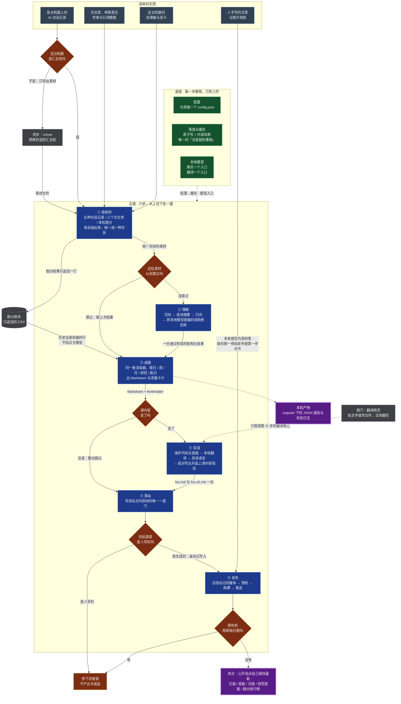

# gadget — 简化后的架构（提案）

> **这是提案，不是现状。** 本文件与配套的 `proposal-simplified.yaml` 都没有改动任何代码，
> 也没有碰 `graph.claude.yaml`。你批准之后，那份 YAML 才会成为 `ideas/graph.yaml`，
> 实现改动才开始。
>
> 口径沿用 `.companion/FORMAT.md`：一个想法一个节点，一条前置一条箭头，每个节点答完八个问题。
> 配色沿用 `graph.claude.html`。

**一句话：** 四种原料，一条六步主路，两个侧门，三件底座。

想法从 **60 个并成 23 个**，终点从 **5 个并成 3 个**，模型后端从 **8 个减到 4 个**，
模型名解析器从 **5 条优先级链减到 1 条**，「内容没变就别重做」的实现从 **7 套减到 2 套**，
语言判定从 **4 个减到 1 个**，「这个文件是不是我们的」从 **5 个答案减到 1 个**，
跨机通道从 **3 条减到 1 条**，
并顺手清掉约 **1,400 行没有调用方或没有驱动者的代码**。

审计还查出**想法图本身有 33 处已经和代码漂移**（第七节），其中两处值得现在就知道：
`I-008`「两个模型共驻一块显卡」的前提已经被一行代码取消了，为它造的 `num_ctx` 旋钮
现在每次「总结↔翻译」切换都在逼运行时重载——**正是那个想法声称要省掉的约 10 秒，
现在每次都在付**；而 `I-038` 那张总览页**会被自己的依赖删掉**（产物目录进了 `.gitignore`，
而发布链整站重建再推送，所以任何一台没有它的机器下次发布就把线上的 `/dag/` 删掉）。

没有删掉任何一个你会想念的能力——会变的地方全部逐条列在第十节，
要你拍板的六件事列在第十一节，我自己最没把握的六处列在第十三节。

---

## 一 · 主路：从上往下读一遍，就是整个项目

读法：**深蓝**是主路六步，**绿**是每一步都用的底座，**橙**是判断点，
**灰虚线**是侧门与可选，**紫**是最终产出。
底座到主路只有一条虚线——它不是第七步，是三件每一步都在用的东西；
画成一条线而不是十八条，正是为了不让这张图变成「什么都连着什么」。

## 二 · 六步各自负责什么、收到什么、交出什么

| 步 | 谁负责 | 收到什么 | 交出什么 | 这一步的判断 |
|---|---|---|---|---|
| ① 取素材 | `tools/summarize/parsers.py`·`usage.py` `tools/research/scout/search.py` `tools/benchmark/benchmark/` | 五种 AI 工具的历史记录 / 三个论文库的接口 / 本机硬件 | 一种形状的素材记录（来源·日期·设备·内容） | 这台机器是汇总机吗 |
| ② 理解 | `common/llm.py` 的 `call_llm_structured` | 素材记录 + 一份 schema + 一段提示 | 一份通过校验的结构化结果 | 这批素材以前算过吗 |
| ③ 成稿 | `tools/summarize/report.py` + 五份版式数据 | 结构化结果 / 跑分 CSV / 用量数字 | Markdown + frontmatter + 用量卡片 | — |
| ④ 双语 | `common/bilingual.py` → `common/translation/` | 一份 Markdown 与它的落点 | `foo.md` 与 `foo.zh.md` 一对，各自盖源内容指纹 | 源内容变了吗 |
| ⑤ 落站 | `common/site.py` | 要写进站点的文件 | 站点内容树里带 `gadget_generated` 标记的文件 | 目标路径是人写的吗 |
| ⑥ 发布 | `tools/website/publish.py` | 整棵内容树 | 公开站点 `tzj2006.github.io` | 预检有阻断级问题吗 |

**信息怎么流动：** 每一步只认上一步交出的那一样东西，不回头读上游的中间产物。
①→② 传素材记录，②→③ 传结构化结果，③→④ 传 Markdown，④→⑤ 传成对的文件，
⑤→⑥ 传整棵内容树。跑分是唯一的旁路：它从 ① 直接到 ③，因为数字不需要大模型读。

## 三 · 判断点只有五个，每个都是一句话

1. **这台机器是汇总机吗** —— 不是就只导出素材、推到远端，本机到此结束。
2. **这批素材以前算过吗** —— 算过就取上次结果，不发起任何推理。（判据：内容哈希）
3. **源内容变了吗** —— 没变就整对跳过，不翻译。（判据：文件里的源内容指纹）
4. **目标路径是人写的吗** —— 是就停下报错，绝不覆盖。（判据：文件里有没有生成标记）
5. **预检有阻断级问题吗** —— 有就中止，不产出半成品站点。（判据：frontmatter 能不能解析）

这就是全部分支。其余每一步都是直的。

## 四 · 底座三件、侧门两个

**底座（每一步都用，只有三件）**

| 件 | 住在哪 | 负责什么 |
|---|---|---|
| 配置 | `common/config.py` | 仓库根一个 `config.json`，五节；取值顺序 命令行 > 环境变量 > 该节 > 默认值。`common/` 自己就读得到，不再靠环境变量转手 |
| 落盘与缓存 | `common/io.py`·`common/cache.py` | 原子写 + 内容哈希 + 磁盘缓存。**全仓唯一**的「没变就别重做」 |
| 本地模型 | `common/llm.py`·`common/engine/` | 聊天一个入口、翻译一个入口，都默认打本机 Ollama；要的模型没下载就当场报错 |

**侧门（两个，明确画在主路旁边）**

- **翻译网页**（`tools/translator/`）——贴文字或传文件，当场翻完。它只调第四步的翻译核心，
  不经过 ①②③⑤⑥ 中的任何一步。输入输出都不落盘、不进站点，所以它是侧门而不是主路的一支。
- **跑分账本**（`tools/benchmark/benchmark_results.csv`）——只追加、永不重写。
  它既是 ① 的产物，也是 ③ 的素材。

**工程底盘（不是一步，是「怎么让这个仓库保持能跑」）**：装机、冒烟、测试基线与覆盖下限、
双语文档、可分发。它们和数据流没有箭头关系，只有同步那一条连进 ①。

## 五 · 新的 23 个节点

| 节点 | 名称 | 所在步 | 吸收了哪些旧想法 |
|---|---|---|---|
| I-061 | 所有配置只放在仓库根的一个文件里，而且共享代码自己就读得到 | 共用底座 | I-001 · I-051（配置那级） |
| I-062 | 原子落盘加一个内容哈希缓存，管住全仓所有「没变就别重做」 | 共用底座 | I-002 · I-011（跳过） · I-013（判据） · I-014（状态） · I-023（缓存） · I-026/I-027（缓存闸门） |
| I-063 | 本地模型只有两个入口；要的模型没下载就当场报错 | 共用底座 | I-003 · I-006 · I-008 · I-051 · I-052 · I-053 |
| I-064 | 把一堆素材交给本地模型，拿回一份结构可靠的结果 | 共用底座 | I-004 · I-005 · I-020 · I-027（两道闸门） |
| I-065 | 把五种 AI 工具的对话记录和 token 用量抽成同一种素材 | 取素材 | I-017 · I-021 |
| I-066 | 从三个论文库检索、排除看过的；一句自然语言也能变成同一份检索条件 | 取素材 | I-026 · I-028 |
| I-067 | 测出本机各精度档的算力，结果只往一份 CSV 账本追加 | 取素材 | I-033 · I-034 |
| I-068 | 各机推到同一个远端目录、汇总机拉下来——全仓只有这一条跨机通道 | 取素材 | I-018（跨机） · I-019 · I-037 · `remote.py` |
| I-069 | 对选中的论文做四项深读 | 读懂并写成稿 | I-029 · I-030 · I-031 |
| I-070 | 一套渲染器按五种版式出 Markdown，版式定义是数据不是代码 | 读懂并写成稿 | I-022 · I-023 · I-032 · I-035（渲染） · I-047（结构） |
| I-071 | 先定下报告好不好的判据，并留一份改动之前的基线 | 读懂并写成稿 | I-046 |
| **I-072** | **终点：按判据重写三种报告的措辞，新旧对照、用户签字才算完成** | 读懂并写成稿 | I-047（措辞） · I-048 · I-049 · I-050 |
| I-073 | 翻译时保住代码和链接，翻完校验语言，成对写出并盖指纹 | 翻成两种语言并发到站上 | I-007 · I-009 · I-010 · I-011 · I-014 |
| I-074 | 写进站点内容树只有一道门：生成的盖标记，人写的一律拒绝 | 翻成两种语言并发到站上 | I-012 |
| I-075 | 一条发布链：补齐双语对 → 压媒体 → 预检 → 构建 → 推送 | 翻成两种语言并发到站上 | I-013 · I-015 · I-016 · I-024 |
| I-076 | 侧门：一个本地网页，贴文字或传文件当场翻完 | 翻成两种语言并发到站上 | I-036 |
| **I-077** | **终点：一条命令跑完从取素材到发布的整条链** | 一条命令跑完全程 | I-016 · I-018（编排） · I-025 · I-032 |
| I-078 | 新机器填一张表跑一条命令就配好，跑一次冒烟就知道有没有弄坏入口 | 别人装上就能用 | I-039 · I-040 |
| I-079 | 不需要网络显卡密钥的测试基线，并给四块没测过的代码定覆盖下限 | 别人装上就能用 | I-041 · I-044 · I-054 · I-055 · I-056 · I-057 · I-058 · I-059 · I-060 |
| I-080 | 文档中英各一份，给人读的和给 agent 读的分开写 | 别人装上就能用 | I-042 |
| **I-081** | **终点：任何人下载下来装一次，就能单独使用五个工具中的任何一个** | 别人装上就能用 | I-043 |
| I-082 | 把仓库拆成公开的工具代码仓和私有的个人数据仓（受阻） | 别人装上就能用 | I-045 |
| I-083 | 把跨项目进度总览页搬去 ai-companion（受阻，等你拍板） | 别人装上就能用 | I-038 |

编号从 I-061 接着往下发，不复用任何旧编号——`FORMAT.md` 的 D5 写了「顺序编号、永不复用」，
而旧编号连同它们的全部历史留在 `graph.claude.yaml` 里可查。

**账怎么对上的**（我核过，结果在下面）：60 个旧编号全部被至少一个新节点吸收，**一个不漏**。
其中 11 个出现在两个节点下，都是有意的——那条想法的两半去了两个地方。
最常见的一种是「它原文大半在讲『内容没变就别重做』」，于是那半并进 I-062 的共用缓存、
另一半留在它本来的阶段（`I-011` `I-013` `I-014` `I-023` `I-026` `I-027`）；
另一种是一个原终点被拆成「做事的那一步」和「跑完全程那个终点」
（`I-016` `I-018` `I-032`），剩下两个是 `I-047`（结构定义 / 措辞）与 `I-051`（配置 / 模型解析）。
所以第八节那张表里「合并」的格子有时会写出两个去处——那不是记错，
是这条想法的两半确实去了两处。

## 六 · 十六处「一个问题被拆成了好几个概念」

这是本轮审计真正的发现。每一行是：同一个问题，今天有几个答案，应该只有一个。
右栏的行号都是实读代码核对过的。

| 一个问题 | 今天有几套 | 证据 | 收成一处 |
|---|---|---|---|
| **打同一个本机服务用几个客户端、「这次用哪个模型」有几个答案** | 2 个客户端 + 5 个解析器（第 6 个还在计划里） | `engine/` 966 行里 540 行是三个非 Ollama 后端加一层抽象基类；同一个本机 Ollama 有两个客户端（`llm.py:107` 走 OpenAI SDK，`engine/ollama.py:114` 走 urllib，各抄一份 base-url 优先级）；五条优先级链（`llm.py:89`·`123`、`base.py:79`·`87`、`frontmatter.py:247`）只有最后一个读 config；而 `llm.py:123-129` 把调用方传的 model 直接丢掉，导致 `json_utils` 文档里那条 haiku→sonnet→opus 升级链在默认后端上是空转 | **I-063**：聊天一个入口、翻译一个入口，各 2 个后端，一个解析器 |
| **内容没变该不该重做** | 7 套实现、7 种存放格式 | src-hash 注释（`bilingual.py:32`）· 块缓存 `_chunk_meta`（`llm.py:479`）· DiskCache（`cache.py:23`）· 配置进程内缓存（`config.py:35`）· `load_json_config` 记忆字典（`io.py:33`）· `.last_build` 时间戳（`publish.py:138`，**实现了两遍**且两份对「生成文件算不算」的判断不一致）· `.translation_state.json`（`translate_site_batch.py:313`），外加推送前 `git diff --cached` 第五道判断。**而 DiskCache 在 `common/` 内部零调用方**——两条最热的跳过路径各自另写了一套 | **I-062**：一个内容哈希缓存（算不算）+ 文件里的指纹（产物来历） |
| **怎么让本地小模型吐出能用的结构** | 7 种机制、5 层抢救、两侧判据不同 | `tool_use`（`llm.py:344`）· `json_object`（`llm.py:202`）· `json_schema`+全 required（`llm.py:166`）· `try_parse_json` 三级（`json_utils.py:56`）· 修引号（`json_utils.py:15`）· 交给模型重排（`json_utils.py:157`）· `summarizer.py:335-446` 五层抢救 + `formatter.py:46` 再兜一次；research 那侧又自己写了一份（`evaluate.py:128`·`141`），判据与 summarize 不同 | **I-064**：一个 `call_llm_structured` |
| **怎么把别的机器上的素材弄过来** | 3 套，远端布局互不兼容 | `ssh_pull.py:55`（ssh+scp）· `remote.py:193`（rclone，对 `<remote>/logs`）· `sync.py:68`（rclone，对 `summarize/logs`）。`remote.py` 257 行**图里没有任何想法认领它**，`_find_rclone` 与 `sync.py:182` 的 `find_rclone` 逐字相同但读不同的配置节；而 `ssh_pull.py:73` 的 glob 少一层目录所以拉不到文件，`test_ssh_pull.py:16,18` 断言的正是这条错路径。顺带：`onboarding.py:84-101` 已经把「配好 rclone 远端」做成 `auto` 的硬性前置 | **I-068**：只留 rclone 一条 |
| **怎么把一段时间的工作写成一份报告** | 日/周/月三份代码 + 3 份 Hugo 部署 + 5 处「算过了吗」 | `weekly_summary.py`（831 行）与 `monthly_summary.py`（952 行）**397 行逐字相同**、相似度 0.45，而它们上面本来就压着 `period_report.py`（410 行）；日报的 Hugo 部署有三份实现（`daily_merge.py:204`·`461`、`daily_deploy.py:117`）；`_find_missing_weeks` 与 `_find_missing_months` 是同一段逻辑写两遍，`cmd_list` 又各写第三四遍；weekly/monthly 各有一对影子缓存函数无调用方 | **I-070**：一个 `render(版式, 结果)`，版式是数据 |
| **「这个文件是不是我们的、能不能动」** | 5 个答案 | 文件里的标记（**三种拼写**，`website_backup.py:32-36`）· 路径白名单 `generated_paths.py` 被三个消费者用**三种不同语义**匹配（`publish.py:128-135` 连任意子目录下的 `benchmark.md` 都算，`preflight_check.py:73-81` 只认精确相对路径，`translate_site_batch.py:155-166` 解析绝对路径）· 而 `publish.py:49-55` 干脆把那两个元组复制了一份。分歧已经有后果：预检和发布对「子目录里的 benchmark.md 算不算生成物」判断不同 | **I-074**：只认文件里的标记，只经 `classify_file` 一个入口；路径清单降级为纯性能捷径，三方统一 import、统一语义 |
| **「一份报告怎么变成站点上的双语文章」** | 4 个发布器 | `period_report.generate_period_hugo_post` · `formatter.generate_hugo_post`（前者的壳）· research 的 `scout/report.generate_hugo_post` · benchmark 的 `publish` —— 四个都是「拼 frontmatter 字符串 → 解析内容目录 → `write_bilingual`」，只差标题、关键词、摘要、相对路径 | `common/` 里一个 `publish_report_post(...)`，四个调用方只填参数。收拢时顺带暴露：`content/benchmark.zh.md` 是一份没人再生成的固定文件，跑分中文页一直陈旧 |
| **怎么补齐缺的那一侧语言** | 2 套，而且第二套会让第一套白做 | 第一份是 `translate_site_batch.plan_pair`（`publish.py` 第 1 步）；第二份是预检的可修档（`preflight_check.py:309-351`），**四步之后又做一遍，而且不写状态文件**——它补出来的那一对下一轮会被当成没翻过再翻一遍。正文语言是否正确也查了三处（`translate_site_batch.py:274`、`preflight_check.py:247`、`common` 的 `wrong_language`），而两处的散文长度门槛还不一样（100 vs 20） | **I-073** + **I-075**：补齐只发生在发布链第一步，预检只报不修 |
| **「这份报告算过了吗」** | 6 套，其中一套根本没有哈希 | 日志里的 `_finalized`（`daily_export.py:137`）· 报告里的 `_finalized`（`daily_merge.py:100`·`334`）· **日报最终缓存只按日期取键、一个哈希都没有**（所以改完措辞重跑会拿到旧报告冒充新产出）· 输出文件存在即跳过（`weekly:626`·`monthly:768`）· `auto` 的 mtime 陈旧判定 · `period_report.py:186` 的 source_hash | **I-062** + **I-070**：一条规则——`hash(输入 + 措辞/结构版本)` 与存在产物旁边的那个相符，就算最新 |
| **「素材怎么到汇总机」—— 顺带：汇总这一步把传输当成了前提** | 3 套传输，最贵的那套是强制的 | 没配 `summarize.rclone_remote` 时 `_rclone_download_logs` 返回空（`remote.py:197-200`），`_cmd_merge_sync_all` 随即以「没有日志」退出 0；而 `onboarding.py:84-101` 把「配好 rclone 远端」做成 `auto` 的硬性前置。**也就是说今天不开云盘账号就出不了日报**，哪怕所有素材都在本机 | **I-068**：传输只留 rclone 一条，**并且是可选的**——汇总只认「素材目录里现在有哪些文件」 |
| **「别把一次失败冻成缓存里的权威结果」** | 4 种形状 | 检索用 `None` 与空列表的返回约定（`search.py:774`）· 筛选与深评用结果形状闸门（`evaluate.py:128`·`141`）· insight 用「成功才写」（`insight.py:457`）· common 的块缓存用「拒绝 parse_error」。而最贵的那次调用（第三轮引用影响分析）**一套都没盖到**——既不在任何文件缓存里，也因为 `call_scout_llm` 不传 cache 而不在 DiskCache 里 | **I-064**：一个 `cache_if(结果, 可用吗)`，硬失败直接抛异常 |
| **「会议 / 作者 / 多源检索 + 缓存」这段分支** | 3 份，**而且已经漂移** | `cmd_search`（`cli.py:134-214`）· `cmd_report`（`cli.py:363-391`）· `route_search`（`ask.py:208-243`）；`ask.py:238` 带注释地给会议检索传 `project=None`，另两份传 `project` | **I-066**：一个 `collect_papers(项目, 检索条件)`，三个命令只差怎么构造检索条件——而那正好就是 `ask` 的模型产物 |
| **怎么给没测过的代码补测试** | 8 个节点 | I-044 汇合点 + I-054 量具 + I-055–I-060 六个区域。八个里没有一个包含独立的设计判断——`how` 与 `why_this_way` 在 I-054–I-060 七个里**全是 `null`**。它们是一份工作分解，不是八个想法 | **I-079**：1 个节点 |
| **「这段文字是不是该有的语言」** | 4 个判定实现 | 让判定变正确的那次修改（只看散文、别被 CSS 和内嵌 HTML 稀释）只落进了其中两个：`protect.py:240` 的 `wrong_language` 与 `scripts/language.py:235`；而 `preflight_check.py:247` 用的是另一个、门槛也不同（100 vs 20），`document.py:85-96` 又另加了一道 frontmatter 英文判定，和 `frontmatter.py:142` 的闸门重叠 | **I-073**：只留 `wrong_language` 一个判定，所有入口都调它 |
| **翻译过的内容怎么记「已经翻过」** | 3 套记账、3 条失效规则 | 生成页用文件里的 `gadget:src-hash:v2:` 注释（`bilingual.py:32`），**唯一的失效办法是有人去手改源码里的 `_MARKER_VERSION`**——`force=True` 刻意不重译（docstring 写明）；手写页用外部的 `.translation_state.json`；预检的可修档补出来的那一对谁都不记 | **I-073**：一条记录一页，内容哈希 + 配方版本（标记版本 + 模型 tag + 措辞版本），谁翻的谁写 |
| **怎么把数字变成能看的东西** | 3 套，其中 1 套已经是死代码 | `charts.generate_daily_chart`（227 行 + matplotlib + 中文字体）**没有任何活调用方**，但 `weekly_summary.py:741`、`monthly_summary.py:875` 还在探测那个 PNG、`period_report.py:152-157` 还在把它拷进站点——一段在等一个没人写的文件的代码 | 卡片（嵌报告）+ plotly 网页（需要交互的那张） |

## 七 · 顺带查出来的：想法图本身已经和代码漂移的地方

审计不只看图，也逐条回去读了代码。下面每一条都是**图写着一件事、代码做着另一件事**。
它们不改变本提案的结构，但会误导任何照着图做事的人——批准后应当随 `graph.yaml` 一起改掉。

| 处 | 图里怎么写 | 代码实际怎么做 |
|---|---|---|
| 总览 + I-006 | 翻译跑 `HY-MT2-1.8B`，「pull 了 HY-MT2 就自动选 Ollama」 | 默认翻译 tag 就是**聊天 tag**（`engine/base.py:22`，经 `resolve_ollama_translation_model`），所以按默认配置 HY-MT2 从来不会被加载 |
| I-008 整条 | 「翻译模型与聊天模型共驻一块显卡」，`num_ctx` 压到 8192 是为了让翻译模型停在 3.6GB | **这个前提已经被一行代码取消了**：`engine/base.py:22` 写着 `DEFAULT_TRANSLATION_MODEL_OLLAMA = DEFAULT_OLLAMA_CHAT_MODEL`——翻译用的就是聊天那个模型，显存上只有一个模型。而为那个前提造的机制全留着，其中一个现在在帮倒忙：聊天运行时按 65536 加载（`serve_local_llm.sh` 的 `MIN_CTX`，并在 `:88-95` 显式检查，因为 `/v1` 会忽略单次 `num_ctx`），原生接口却认 8192——所以每次「总结↔翻译」切换都逼 Ollama 重载一次运行时，**正是这个想法声称要省掉的那约 10 秒，现在每次切换都在付** |
| I-036 的模型下拉框 | 可以在界面上选翻译模型 | 列的是 HuggingFace 仓库名（`models.py:12-17`）；默认那条会被解析成已服务的聊天 tag，选**别的**会掉出自动选 Ollama 的闸门、于是悄悄把聊天模型卸掉去在进程里加载 torch。选什么和真用什么是两回事 |
| I-052（状态 `todo`） | 待办：默认模型换成 `gemma4:26b`、复核模型跟随聊天默认 | **已经做完了**：`llm.py:62` 就是 `gemma4:26b`，`frontmatter.py:44` 就是 `DEFAULT_REVIEW_MODEL = DEFAULT_OLLAMA_CHAT_MODEL`，连钉住这条关联的测试都在 |
| I-005 | 块结果「两两归并」 | 能塞进一次调用就一次归并完，塞不下才分组递归——从不两两 |
| I-022（状态 `done`） | 三子图 PNG 与 HTML 卡片并列产出 | PNG 路径已死（无活调用方），而三处代码还在等那个文件 |
| I-027 | 三轮都有缓存闸门，`analyze_citations` 是第三轮 | 只有前两轮有闸门；`evaluate_papers_for_project` 根本不调 `analyze_citations`，第三轮在 `cli.py` 的循环里 |
| I-025（状态 `done`） | `auto --deploy` 第一步 ssh 拉各设备日志 | 确实调了，但按 I-019 的缺陷它拉回零个文件、只打一条警告——「多设备汇总」这个卖点在默认路径上没有兑现 |
| I-018 | merge 汇总各设备的内容 | 设备级预摘要只有 `--summarize` 产出，而 `auto.py:195` 不传它，所以那条路在实际流水线里从不执行 |
| I-015 | 自动修只碰手写内容（怕弄乱生成文件的指纹） | 靠**路径清单**判断（`preflight_check.py:73-81`），从不读文件里的 `gadget_generated` 标记——生成文件放在清单外就会被改 |
| I-060 | 压缩程序没装时「给出可读的失败」 | 现在是静默跳过（`publish.py:236-238` 打一行字然后返回 0） |
| I-041（状态 `done`） | 「每个模块自带 tests/ 目录」 | `tools/benchmark/` 没有 tests/（3126 行），`tools/benchmark/AGENTS.md:20` 自己写着「No pytest suite」 |
| I-016 | 第 7 步就是「提交推送 public/」 | 还有第五道变更判断：`git diff --cached --quiet` 决定到底要不要提交推送 |
| 跑分中文页 | 站点有中英两份跑分页 | `content/benchmark.zh.md` 是一份固定文件，**没有任何代码再生成它**——中文页一直是陈旧的 |
| I-038 的产物 | 总览页发到站点 `/dag/` | 产物目录 `tools/website/static/dag/` 在 `.gitignore:43`，也不在 `sync.py` 的 website 同步类目里，所以它只存在于生成它的那台机器；而发布链清空 `public/` 整站重建再 `git add -A` 推送——**任何一台没有这个目录的机器，下一次发布就把线上的 `/dag/` 删掉**。这个功能会被自己的依赖删掉 |
| 预检三档分级 | BLOCK / WARN / FIX 对应退出码 1 / 2 / 就地修 | `preflight_check.py:487` 返回「有警告就 2、否则 0」，而 `publish.py:359-362` 只区分退出码 1——**退出码 2 和 0 完全等价**，警告这一档对流水线没有任何影响 |
| 压缩的增量 | 只压改动过的媒体 | 时间边界只在推送成功后才前移（`publish.py:374`），所以预检中止或构建失败之后重跑，会对已经压过的图片**再有损压一次**，画质逐次退化 |
| 全图 | — | Hugo 构建是**全量**的：`public/` 每轮清空重建。图里没有任何节点提到这件事，所以前面那些增量判据省的只是翻译和压缩，不是构建 |
| I-020 的抢救层 | 模型输出跑偏时自动修回合法报告 | 这条链**只保护日报**——`_finalize_report` 的调用点只有 `summarizer.py:460` 与 `503`；周报月报走的是不带抢救的 `timed_llm_call`，只靠渲染器里的类型判断兜着 |
| I-046 · I-047 · I-050 的 `code:` | 指向三份设计文档 | 三份**都不存在**：`docs/guides/report-quality-rubric.md`（I-046 与 I-050 指的是同一份）与 `docs/ecl/report-structure-redesign.yaml`（`docs/ecl/` 下 19 个文件，没有这个名字） |
| I-021 的用量抓取 | 通过 ccusage 抓 token 用量 | 版本低于 20 时会**静默在用户机器上跑 `npm install -g ccusage@latest`**，再静默回落到 npx——装全局包成了生成一次日报的副作用 |
| I-032 的 `what` | 研究周报汇入了「学者画像」 | `generate_daily_report`（`report.py:44-113`）里**没有任何 profile 键**——画像走自己的 `output.py:223-264`，而且用的是 `write_site_content` 不是 `write_bilingual`，**所以画像页一直没有中文孪生页** |
| I-027 的第三轮 | 引用影响分析是三轮流水线的第三段 | 它根本不在 `evaluate_papers_for_project` 里（那个函数在 `evaluate.py:502` 直接返回），而是 `cli.py:254-269` 的一段内联循环，硬编码只取前 5 篇，没有缓存条目也没有闸门 |
| I-045 的硬阻塞 | 「拆分前必须先从 git 历史里清理曾提交过的私人内容与 secrets」，所以受阻 | 这条被**量错了**，而量错正是它一直卡在受阻的原因：实测历史只有 **20 个提交**（4b800f4 → 43a29db），历史上出现过 818 个路径，真正要摘掉的只有 `docs/ecl/dag/` 下 **3 个文件**。而且 `tokens/` 从**第一个提交**起就在 `.gitignore` 里，`git log --all --name-only` 核过——`tokens/` 与 `config.json` **从来没有被提交过**，所以「历史里有 secrets」这个前提本身不成立。一次 gitleaks 当闸门 + 一次对 3 个路径的 `filter-repo`——几小时，不是一个项目 |
| `I-041` / `I-043` 的验收命令 | 「各套件全绿」「装上就能用」 | **pytest 没有在任何一个可选依赖里声明**（`pyproject.toml` 八个 extras 里 grep 不到它），所以一个干净克隆按 `AGENTS.md` 跑那几条 pytest 命令会直接 `ModuleNotFoundError`——这对「任何人装上就能用」是直接的反例 |
| I-043 与 I-045 的关系 | I-045 挂在终点 I-043 之后，且「不被任何终点依赖是预期的」 | 终点说的是「**任何人**下载下来就能用」，而这个仓库是私有的——拆仓是唯一能交付这个结果的路。它不该在终点之后，它是终点的前置 |
| I-044 的 `how` | 那 474 个测试骨架「pytest 默认不收集」是因为生成方式 | 真实原因是 `.devcompanion` 开头那个点命中了 pytest 的 `norecursedirs` |
| I-043 的 `verify` | — | 与 I-040 的验证命令**逐字相同**（都是 `bash scripts/smoke.sh` / `0 failed`）。一个终点的验收直接复用了它某个前置的 |
| I-034 的显存换算 | 按显存自动选矩阵规模 | 上限钳在 2 的 17 次方（N=131072），那需要约 1.3 TB 显存才能放下三个 FP32 矩阵——这个上限**永远不可能生效** |
| 行号 | `code[].lines` 精确到行 | 系统性多出 2–10 行（多数把尾部空行算进去了）；`I-043` 引 `pyproject.toml 1-80`，而那个文件**总共 28 行** |
| `research_scout.py` shim | 理由是「MCP Server 兼容，`mcp_server.py` 无需改动」 | 仓里**没有** `mcp_server.py`。而 `research/cache.py` 那个 shim 反过来是真正承重的——7 处活调用 |
| AGENTS.md / 工具文档 | `weekly_summary.py`·`monthly_summary.py` 是 re-export shim；发布顺序是「压媒体 → 翻译 → 预检」 | 两者都是完整实现（831 + 952 行，各带 `main()`）；翻译是第 1 步，压媒体在它之后 |
| 未被任何想法认领的代码 | — | `tools/summarize/remote.py`（257）· `daily_summary.py`（110）· `common/html_text.py`（101）· `common/hugo.py`（64）· `common/paths.py`（25）· `translate_documents_batch`（`document.py:162-273`，**零调用方**）· `tools/benchmark/scripts/` 的排行榜提交与入库流水线（609 行，为一个**不存在的** CI 工作流写的——仓里没有 `.github/` 目录）· `scripts/wsl_local_llm_cleanup.sh`（127） |

## 八 · 逐条审计：60 个想法各自的去向

裁决用六个词。对应你给的四类：**保留** = Keep；**简化** = Keep but simplify；
**合并** 与 **拆开** = Merge（拆开是指它的两半并进了两个不同的节点）；
**删除** 与 **移出** = Remove（移出是指能力保留但换仓库）。

统计：保留 4 · 简化 9 · 合并 39 · 拆开 5 · 删除 2 · 移出 1。

| 编号 | 原名称 | 原状态 | 裁决 | 去向与理由 |
|---|---|---|---|---|
| I-001 | 全部配置只放在仓库根的一个 config.json 里 | 已完成 | **简化** | → I-061。能力不变，但删掉「配置值先灌进环境变量、common 再读环境变量」那条桥，配置节从七个并到五个。 |
| I-002 | 写文件不会留下半截、重跑能直接用上次的缓存 | 已完成 | **合并** | → I-062。原子写与内容哈希缓存留着，但从此它是全仓唯一的「没变就别重做」判据。 |
| I-003 | 四种 LLM 后端用同一个开关切换 | 已完成 | **简化** | → I-063。四个聊天后端减到两个：删 claude_cli（子进程调命令行，54 行）与 anthropic（65 行）；ollama 与 openai 共用一条代码路，留两个只多 14 行。 |
| I-004 | 让本地小模型稳定吐出报告结构 | 已完成 | **合并** | → I-064。约束解码与全 required 原样保留，移进那一个结构化调用函数里。 |
| I-005 | 超长输入切成块分别摘要、再合并成一份 | 已完成 | **合并** | → I-064。切块、块缓存、层级归并原样保留，和结构修复合成同一条链。 |
| I-006 | 本地翻译引擎按本机装了什么自动选推理后端 | 已完成 | **简化** | → I-063。四个翻译推理后端减到两个：留 ollama 与 transformers，删 vLLM（93 行）与 llama.cpp（104 行）；只剩两个实现之后 base.py 的抽象基类（139 行）也不需要了。 |
| I-007 | 翻译时保住代码和链接不被改动、按语言挑切块大小 | 已完成 | **合并** | → I-073。占位符保护与按语言选切块上限原样保留。 |
| I-008 | 翻译模型与聊天模型共驻一块显卡 | 已完成 | **合并** | → I-063。num_ctx 预算、并发数、keep_alive、收尾释放显存全部原样保留——这是实测出来的数字，不动。 |
| I-009 | 翻译结果落盘前先检查：拦下原样返回和语言不对的输出 | 已完成 | **合并** | → I-073。三道校验原样保留，位置仍在「落盘之前」。 |
| I-010 | 标题和标签只往英文方向翻，翻完让本地模型复查一遍 | 已完成 | **合并** | → I-073。标签单向翻译与本地模型复核原样保留（复核被静默关闭的缺陷由 I-063 修掉）。 |
| I-011 | 双语页面可以放心重跑：源文件没变就整对跳过 | 已完成 | **合并** | → I-073（成对写出与重试）+ I-062（跳过判据）。文件里的指纹保留，它从此只负责「产物自证来历」。 |
| I-012 | 生成内容与手写文章同住一处，手写的绝不被覆盖 | 已完成 | **保留** | → I-074。能力一字不改；只把 site_staging.py 与 website_backup.py 两份文件并成 common/site.py 一份。 |
| I-013 | 只压缩上次构建之后新改动的图片和视频 | 进行中 | **合并** | → I-075。增量压缩保留，但判据从 .last_build 的时间戳换成内容哈希——touch 一下不再触发重压。 |
| I-014 | 只翻译真正改过的那一侧，避免中英来回互翻 | 已完成 | **合并** | → I-073。能力保留（只翻真正改过的那一侧），但 .translation_state.json 删掉：它和文件里的指纹回答同一个问题。 |
| I-015 | 发布前自动检查常见问题，能修的顺手修掉 | 已完成 | **合并** | → I-075。五项检查保留，阻断与警告两档保留；**可修档删掉**——它是补齐双语对的第二份实现（preflight_check.py:309-351），而发布链第一步四步之前刚做过同一件事，且第二份不写状态文件，补出来的那一对下一轮会被再翻一遍。另外警告档今天其实是空转：publish.py:359-362 只区分退出码 1。 |
| I-016 | 一条命令完成双语博客从翻译到发布的全流程 | 已完成 | **合并** | → I-077。原终点之一；与 I-025、I-032 是同一条链的三种素材，合成一个终点。 |
| I-017 | 从各家 AI 工具的历史记录里按日期抽出对话 | 已完成 | **合并** | → I-065。五个 parse_* 原样保留——这是真实边界上的真实差异，不是抽象过度。 |
| I-018 | 多台设备先各自导出对话、再汇总成一份当天日报 | 进行中 | **拆开** | 跨机那一半 → I-068（并入唯一的同步通道）；编排那一半 → I-077（并入那一条命令）。 |
| I-019 | 用 ssh 把远端机器的对话日志拉回本机 | 待办 | **删除** | ssh 加 scp 这条通道删掉。它今天是坏的（ssh_pull.py:73 的 glob 少一层目录，拉不到任何文件，而 test_ssh_pull.py:16,18 把这条错路径锁进了测试），而 rclone 那条已经在用并且不要求两台机器同时在线。能力由 I-068 承担。 |
| I-020 | 模型输出结构跑偏时自动修回合法的报告，而不是崩溃 | 已完成 | **合并** | → I-064。信封拆解、概览回套、列表兜底、重试一次全部原样保留，和 research 那侧的两道闸门合成一套。 |
| I-021 | 按 AI 工具逐个统计 token 用量并累积历史 | 已完成 | **合并** | → I-065。逐源抓 token 用量原样保留，归一成同一种素材形状。 |
| I-022 | 把 token 用量画成图表和卡片嵌进报告 | 已完成 | **简化** | → I-070。HTML 用量卡片保留；matplotlib 那张 PNG 删掉——它今天**已经是死代码**（charts.generate_daily_chart 无活调用方，227 行），而 weekly:741 / monthly:875 / period_report.py:152-157 三处还在等它产出的文件。这个想法的状态是 done，但它描述的产物早就没有了。 |
| I-023 | 把一段时间的日报再汇总成周报和月报 | 已完成 | **合并** | → I-070（版式）+ I-062（缓存）。周报月报不再是两份代码，是同一个函数的两份版式数据。 |
| I-024 | 把报告作为中英双语文章发到博客上 | 已完成 | **合并** | → I-075（发布）+ I-070（成稿）。报告当双语文章发出去这件事不变。 |
| I-025 | 一条命令跑完从拉日志到发布的整个日报流程 | 已完成 | **合并** | → I-077。原终点之一。 |
| I-026 | 从多个论文库检索新论文，并排除已经看过的 | 已完成 | **合并** | → I-066。多库检索与已看过过滤原样保留，含「硬失败返回 None、真空返回空列表、只缓存后者」那条。 |
| I-027 | 论文分三轮逐步筛选评分，失败的模型结果不写进缓存 | 已完成 | **拆开** | 三轮筛选评分 → I-066 与 I-069；两道 is_usable 缓存闸门 → I-064（和 summarize 那侧的判据合成一套）。顺带纠正：图说三轮都有闸门，实际只有前两轮有；而 evaluate_papers_for_project 根本不调 analyze_citations，第三轮在 cli.py 的循环里。 |
| I-028 | 一句自然语言提问自动变成检索计划并执行 | 进行中 | **简化** | → I-066。自然语言入口保留，但从「一个模式」降级成「同一个检索函数的另一种填参方式」，删掉 route_search 这一层分派。 |
| I-029 | 读论文全文分析写作方法，并汇总审稿意见的共识与分歧 | 进行中 | **合并** | → I-069。全文写作分析与审稿共识原样保留。 |
| I-030 | 自动生成一位学者的研究画像、影响力分级和师生关系 | 进行中 | **合并** | → I-069。学者画像、影响力分级、师生关系原样保留，含抓主页那条的内网地址防护——那是跟着不可信输入走的网络请求，一行都不能省。 |
| I-031 | 分析一篇论文引用了谁、又被谁引用 | 进行中 | **合并** | → I-069。引用与参考文献原样保留。 |
| I-032 | 把论文检索与学者分析的结果汇成一份研究周报发布 | 已完成 | **合并** | → I-070（渲染）+ I-077（终点）。原终点之一；研究周报是同一条链的另一种素材，不是另一个终点。 |
| I-033 | 抗后台干扰的跑分计时，结果只往 CSV 追加、从不覆盖 | 进行中 | **合并** | → I-067。只追加的 CSV 账本与抗干扰计时原样保留（追加是 AGENTS.md 的硬规则）。顺带收两处：这个想法的 future 说「CSV 是唯一事实来源」，而那 20 列的表头今天声明了三遍、零处交叉校验（core.py 的字典字面量 + ingest 的 CSV_COLUMNS + submit 的字段表）；另外 sync.py 备份的跑分路径根本不存在，而 7 处文档还在教用户去看那个路径。 |
| I-034 | 自动识别各家厂商的 GPU 并在每个数值精度档上跑分 | 进行中 | **合并** | → I-067。分厂商探测与逐精度档跳过原样保留。与 I-033 合并是因为计时、探测、落盘是同一件事的三个部分。 |
| I-035 | 从跑分数据生成可交互的图表报告和排行榜页面 | 进行中 | **拆开** | 报告渲染 → I-070；plotly 那张可交互网页留在 benchmark 不动（它是唯一需要交互的产物，卡片替不了）。 |
| I-036 | 在本地网页界面里翻译贴入的文字或上传的文档 | 已完成 | **保留** | → I-076。能力一字不改，但在图上从「主路的一支」改画成侧门，说清它只借用第四步的翻译核心。 |
| I-037 | 用 rclone 在多台设备之间同步数据文件 | 已完成 | **合并** | → I-068。rclone 同步成为全仓唯一的跨机通道，顺带吸收图里没人认领的 tools/summarize/remote.py（257 行，另一套 rclone 参数表）。 |
| I-038 | 一个带密码保护的网页，总览所有项目的进度 | 进行中 | **移出** | → I-083（blocked，需你先拍板）。能力保留，但搬去 ../ai-companion 生成，本仓只留「它是又一个内容生成器」。今天它是 scripts/sync.py:526-608——一个 rclone 工具里藏着一条调隔壁仓库 TypeScript 脚本的发布链，是全仓唯一一处向仓库外伸手的代码。 |
| I-039 | 新机器填一张表、跑一条命令就完成全部环境配置 | 已完成 | **合并** | → I-078。装机六步原样保留。 |
| I-040 | 一条命令快速检查每个工具还能不能正常启动 | 已完成 | **简化** | → I-078。冒烟保留，与装机合并（同一件事的两头：装完就该冒烟，冒烟失败就回去看装机哪步没成）。但它的「缺依赖 vs 真坏了」分类器过宽：smoke.sh:24 的 grep 里那个 `|not found` 会把「文件不存在」「命令不存在」这类真失败报成跳过——而跳过是不会让人去看的。去掉那个分支。 |
| I-041 | 不需要网络、GPU 或 API key 也能全部跑通的测试基线 | 已完成 | **合并** | → I-079。纯打桩、不需要网络显卡密钥的基线原样保留。但它标的是已完成而断言「每个模块自带 tests/」——tools/benchmark/ 3126 行至今没有 tests/ 目录，该工具自己的 AGENTS.md:20 写着「No pytest suite」。 |
| I-042 | 文档中英各一份，给人读的和给 agent 读的分开写 | 进行中 | **简化** | → I-080。结构一字不改，但人工验证换成一条能跑的命令。原来那条（「对照目录确认章节一一对应」）查的正好是已经对的那一半，漏掉的是坏的那一半——内容漂移：tools/website/AGENTS.md:3 写的发布顺序与代码不符，AGENTS.md:40 的 scripts/ 清单漏了两个文件，AGENTS.md:50 少记了一个配置节。真正的工作量是逐个修内容漂移。 |
| I-043 | 任何人 clone 下来装上就能用的五件套工具箱 | 进行中 | **保留** | → I-081。终点保留，但前置从十四条换成六条：九条已并进别处，另外去掉四条本来就不 gate「别人能不能装」的（测试、用哪个模型 tag、那张总览页），**加上一条原图漏掉的——拆公开/私有两仓**。原图让这个终点在仓库私有的前提下声称「任何人都能装」，而唯一能交付它的节点却挂在它后面。 |
| I-044 | 给四块没有测试覆盖的代码补齐单元测试——下面七件小事全部做完才算数 | 待办 | **删除** | → 并进 I-079 后这个汇合点本身消失（它自己的文本就说它不写任何代码，ccthink 还在 2026-09-01 把它的 code 与 verify 都摘了）。其中一条事实要搬走而不是丢掉：它说那 474 个测试骨架「pytest 默认不收集」是因为生成方式——真实原因是 `.devcompanion` 的开头那个点命中了 pytest 的 norecursedirs。 |
| I-045 | 把仓库拆成公开的工具代码仓和私有的个人数据仓 | 受阻 | **简化** | → I-082，并且**从受阻改成待办、从终点之后挪到终点之前**。记着的硬阻塞「先清理 git 历史」被量错了：实测这个仓库历史只有 20 个提交、历史上出现过 818 个路径，而真正要从历史里摘掉的只有 docs/ecl/dag/ 下 3 个文件——一次 gitleaks 当闸门加一次对 3 个路径的 filter-repo，几小时而不是一个项目。同时它成为 I-081 的前置：终点说的是「任何人」，而仓库是私有的，拆仓不是可选项。 |
| I-054 | 把「这块代码被测到了多少」量成一个数字，并给每块各定一条不许跌破的下限 | 待办 | **简化** | → I-079。覆盖率**量具**保留，**门槛不建**：本仓没有任何能挂门槛的闸门——没有 .github 目录、没有任何 pytest 配置（pytest.ini / setup.cfg / tox.ini 都不存在，28 行的 pyproject.toml 里也没有 [tool.pytest]）、八个可选依赖里既没 coverage 也没 pytest-cov。量具就是加一个 dev 依赖和一行带 --cov 的命令；一个没有闸门的门槛只是写在文档里的数字。 |
| I-055 | 用测试钉住跑分结果只会往账本里追加、绝不重写已经存在的行 | 待办 | **合并** | → I-079。跑分账本只追加的测试。 |
| I-056 | 用测试钉住没有显卡或没装深度学习框架的机器上跑分会跳过而不是崩溃 | 待办 | **合并** | → I-079。没显卡没框架时跳过而不崩的测试。 |
| I-057 | 用测试钉住学者画像在抓不到主页、遇到内网地址时的退路 | 待办 | **合并** | → I-079。学者画像与内网地址防护的测试。 |
| I-058 | 用测试钉住论文全文分析和引用查询在缓存命中与依赖缺失时的行为 | 待办 | **合并** | → I-079。论文深读的缓存与依赖缺失测试。 |
| I-059 | 用测试钉住周报和月报在字段缺失时降级渲染而不是整个崩掉 | 待办 | **合并** | → I-079。周月报字段缺失时降级渲染的测试——它是 I-070 去重的真正前置。 |
| I-060 | 用测试钉住只有真正改动过的图片和视频才会被重新压缩 | 待办 | **合并** | → I-079。媒体增量判据的测试。 |
| I-051 | 「这次该用哪个聊天模型」只由一个函数决定 | 待办 | **拆开** | 配置那一级 → I-061；模型名解析 → I-063。原来三个节点（I-051/052/053）说的是同一件事：换模型只改一处、换错立刻报错。 |
| I-052 | 默认聊天模型换成 gemma4:26b，全仓只保留这一处硬编码的默认模型名 | 待办 | **合并** | → I-063。**注意：这个想法标的是待办，但代码里已经做完了**——llm.py:62 就是 gemma4:26b，frontmatter.py:44 就是 DEFAULT_REVIEW_MODEL = DEFAULT_OLLAMA_CHAT_MODEL，钉住这条关联的测试也在。所以它在新图里是已完成的一部分，不是待办。 |
| I-053 | 模型没 pull 时立刻报错并列出可用 tag | 待办 | **合并** | → I-063。没下载就报错并列出可用 tag、不可达时不拦，原样保留。 |
| I-046 | 先定下报告质量的评分标准，并留存改动前的基线样本 | 待办 | **保留** | → I-071。唯一一个「先有判据才能谈改进」的前置，不能并进别处。 |
| I-047 | 重新设计日报、周报、月报各自的板块结构 | 待办 | **拆开** | 板块结构定义 → I-070 的版式数据（结构从此是数据不是文档）；措辞部分 → I-072。 |
| I-048 | 按新结构重写日报的 prompt，并改好配套代码 | 待办 | **合并** | → I-072。日报措辞重写与缓存版本号原样保留。 |
| I-049 | 按新结构重写周报和月报的 prompt，并改好配套代码 | 待办 | **合并** | → I-072。周月报措辞与缓存失效修正原样保留。 |
| I-050 | 新旧报告逐项对照打分，用户认可签字后才算完成 | 待办 | **合并** | → I-072。原终点之一；「用户对照签字」成为 I-072 的人工验证条件，而不是另一个节点。 |

## 九 · 保留了什么、合并了什么、简化了什么、删掉了什么

**保留（能力与形状都不动）—— 4 个**
`I-012` 站点归属与备份 · `I-036` 翻译网页 · `I-043` 可分发五件套（终点，但前置换过）·
`I-046` 报告质量判据。这四个各自只解决一个问题，已经是最简形状，动它们只会变差。

**合并（能力全留，实现收成一处）—— 44 个想法 → 11 个节点**
见第六节那十六行，加上四组更直白的：学者画像 + 引用 + 全文深读 → 一个可选深读节点；
装机 + 冒烟 → 一个节点；计时 + 探测 + 落盘 → 一个跑分节点；
三个原终点（自维护博客 · 日报流水线 · 研究周报）→ 一个终点，
因为它们是同一条链的三种素材。

**简化（能力留下，机制换成更少的那一种）—— 9 处**

| 处 | 今天 | 提案 | 为什么这样更好 |
|---|---|---|---|
| 聊天后端 | 4 个（ollama · anthropic · openai · claude_cli） | 2 个（ollama · openai） | `claude_cli` 是对一个命令行的子进程调用（54 行，而且「取纯文本」和「取 JSON」两套写了两遍）；`anthropic` 是独立一套（65 行，同样写两遍）；而 ollama 与 openai 共用同一条代码路，留两个只多 14 行 |
| 翻译后端 | 4 个 + 抽象基类（540 行只服务后三个） | 2 个（ollama · transformers），基类去掉 | 留 transformers 就保住了「没装 Ollama 也能翻译」，它是唯一纯 pip、不用额外进程和编译的那个。`llamacpp` 连批量都没有（顺序循环），它给不了 Ollama 那条给不了的东西 |
| 增量判据 | 7 套 / 7 种格式（含两份 `.last_build` 实现、互相不一致） | 2 套：内容哈希缓存（算不算）+ 文件内指纹（产物来历） | 时间戳比哈希弱：`touch` 一下就重压，改完又改回去反而不重压；而 `.last_build` 只在推送后才更新，中途失败会让这轮压好的媒体下轮再压一遍 |
| 自然语言检索 | 一个独立模式（含 `route_search` 分派层） | 同一个检索函数的另一种填参方式 | `cmd_ask`（`cli.py:418`）与 `cmd_report`（`329`）本来就汇合到同一个 `run_evaluation_pipeline` 与 `finalize_report`；真正新增的只有「把一句话变成检索参数」那几十行 |
| 覆盖率门槛 | 给六块代码各定一条「不许跌破的下限」 | 只加量具，不建门槛 | 本仓没有任何能挂门槛的闸门：没有 `.github`、没有任何 pytest 配置、八个可选依赖里既没 coverage 也没 pytest-cov。一个没有闸门的门槛只是写在文档里的数字 |
| 拆公开/私有两仓 | 受阻，硬阻塞是「清理 git 历史」 | 待办，而且是「别人装上就能用」那个终点的**前置** | 那条阻塞被量错了：20 个提交、3 个要摘的路径，几小时的事。而终点说的是「任何人」，在私有仓的前提下它不可能达成 |
| 双语文档的验收 | 人工对照目录确认章节一一对应 | 一条比对标题层级的命令 | 人工那步查的正好是已经对的那一半；坏的那一半是内容漂移，人工对目录看不出来 |
| 冒烟的「缺依赖 vs 真坏了」 | grep `ModuleNotFoundError\|No module named\|not found` | 去掉第三个分支 | `not found` 会把「文件不存在」「命令不存在」这类真失败报成跳过，而跳过是不会让人去看的 |
| 配置 | 6 节（`config.example.json` 里那个 `translation` 节 AGENTS.md 没记）+ 两座桥 + translator 另有 11 个环境变量旋钮不在 config 里 | 5 节，`common/` 直接读，环境变量旋钮收进 config | `cli_defaults()` 要在 7 处各调一次才生效，`apply_env_from_config()` 只有 summarize 装了——research 与 translator 单独跑时同一个键根本不生效 |

**删掉（架构层面，1 个想法 + 21 个机制）**
`I-019` ssh 拉日志（已坏，rclone 那条更好且已是 `auto` 的硬性前置）·
`claude_cli` 与 `anthropic` 后端 · vLLM 与 llama.cpp 翻译后端 · `engine/base.py` 抽象基类 ·
`.last_build` 与 `.translation_state.json` 两个状态文件 · `GADGET_DEFER_HUGO_UPDATE` ·
`_ENV_FROM_CONFIG` 环境变量桥 · `clear_cache()` 与它约 20 处调用点（缓存改按文件修改时间取键）·
`route_search` 分派层 · 预检的可修档与三档分级（只留「会让页面构建不出来」一档，
退出码只有 0/1；`Issue.level` 与退出码 2 一并删掉）· `_append_manifest` / `record_blocked`
那本账（强制覆盖留一份带时间戳的副本就够，账本没有第二个读者）·
穿透五层的 `overwrite_human` 开关 · 每个媒体文件一个子进程的压缩方式（改成函数调用）·
`--summarize` 设备级预摘要那条分支（`auto` 从不传它）· `_ensure_ccusage_global` 的
静默全局安装（改成一条说清「请运行哪条命令」的报错）·
`create_project_from_query` 与 `list` 里 `status=='ask'` 的过滤、`--all`、零结果 `rmtree`
那个分支（`ask` 不再是一种项目）· `scoring_config` 的每次重读与 `set_top_venues` 的
全局改写（三个加权打分器按「有好默认值就别加旋钮」统一硬编码）·
翻译时对 `num_ctx` 的覆盖（它现在每次切换都在逼运行时重载）·
`repair_json_with_llm` 里那条 haiku→sonnet→opus 升级链（默认后端会丢掉 model 参数，
所以它今天就是把同一个调用发三遍）。
（frontmatter 的模型复核本来在这张单子上，已经撤回——见第十三节第 1 条。）

**顺手该删的死代码（不损失任何能力，约 1,400 行）**
这些是审计时读代码读出来的，不是架构判断——它们今天就没有调用方或没有驱动者：

| 处 | 行数 | 为什么是死的 |
|---|---|---|
| `tools/summarize/charts.py` + 三处悬空消费点 | ~250 | 无活调用方；而 `weekly:741`、`monthly:875`、`period_report.py:152-157` 还在等它产出的 PNG |
| `common/translation/document.py:162-273` `translate_documents_batch` | 112 | 第二套整文档翻译流水线，零调用方 |
| `tools/benchmark/scripts/` 排行榜提交与入库 | 609 | 为 `.github/workflows/daily-publish.yml` 写的，而仓里**没有 `.github/` 目录** |
| `weekly/monthly` 的影子缓存包装函数 4 个 | ~30 | `run_cached_period_llm` 早就取代了它们 |
| `preflight_check.py:120` `split_frontmatter_raw` | ~10 | 零调用方，而 `common` 里已有 `split_frontmatter` |
| `translator/core.py:36-42` ImportError 兜底 | 7 | `common/engine/__init__.py:43-44` 两种拼法都导出了，except 分支不可达 |
| `translator/core.count_chunks` | 10 | 重复实现了已导出的 `common.count_translation_chunks` |
| `research/config.py:223-230` `resolve_output_dir` · `openreview_client.py:51` `SEARCH_YEARS` | ~15 | 零调用方 / 零消费者 |
| `sync.py` 的 `CATEGORY_ALIASES`（`test`→`benchmark`）+ 三个只服务这一个别名的函数 | ~20 | 一个改名的遗留；旧对象本来也没迁移 |
| `sync.py:99,119` 同步一个没人写的跑分 CSV 路径 | — | 真实路径是 `tools/benchmark/benchmark_results.csv`；而 `TUTORIAL.md`（中英）与 `docs/reference/tools.md` 共 7 处还在教用户去看那个不存在的路径 |
| `--summarize` 设备级预摘要 | — | 唯一的产出者，但 `auto.py:195` 不传它，所以实际流水线里从不执行 |

**移出本仓 —— 1 个**
`I-038` 跨项目进度总览页 → 搬去 `../ai-companion` 生成，本仓只留落站那道门。需你拍板。

## 十 · 行为会变的地方（这是本提案唯一可能让你不舒服的部分）

| # | 今天可以 | 改完之后 | 影响 |
|---|---|---|---|
| 1 | `--api anthropic` / `--api claude_cli` 用 Claude 生成报告 | 只剩 `ollama` 与 `openai`；要用 Claude 得经一个 OpenAI 协议兼容网关 | **中，待你拍板。** 仓库的既定默认是全本地无密钥，云端那条本来就是二等公民（`call_openai` 刻意停在 `json_object`，因为云端的严格 schema 会拒掉这些定义） |
| 2 | 只装了 vLLM 或只有 GGUF 的机器自动选到对应后端翻译 | 要么跑 Ollama，要么 `pip install transformers` | 小。没有证据表明这两条路在任何一台在用的机器上被选中过；`llamacpp` 连批量都没实现 |
| 3 | `auto` 用 ssh 去远端跑导出再 scp 回来 | 每台机器自己定时导出并 rclone 推到远端，汇总机拉下来 | 小，而且是修好不是退化：今天那条 scp 路径少一层目录，拉回零个文件；而 `onboarding.py:84-101` 已经把 rclone 远端做成 `auto` 的硬性前置了 |
| 4 | 报告里嵌一张 matplotlib 的 PNG | 只有 HTML 用量卡片 | **无。** 那条路今天已经是死的 |
| 5 | `touch` 一个媒体文件强制重压 | 只有内容真的变了才压；要强制就加显式的 `--force` | 小，但是行为变化，写出来 |
| 6 | `GADGET_DEFER_HUGO_UPDATE=1` 控制中间步骤不构建站点 | 不需要了——整条链里发布只在最后调一次 | 无。这个开关存在的唯一原因是每一步各自会去发布 |
| 7 | `scripts/sync.py --category dag` 在本仓生成并发布进度总览页 | 这条命令从本仓消失，生成移到 ai-companion | **中，待你拍板。** 能力不删，换仓库 |
| 8 | 周报和月报各一份 Python 文件，可单独改其中一份的渲染 | 两份合一，差异在版式数据里改 | 小，但顺序要对：这次合并曾因「没有单元覆盖、回归风险高」被拒过一次，所以 I-070 的前置是 I-079（补测试），不能倒 |
| 9 | 预检的可修档会就地补出缺的那一侧语言 | 预检只报不修，补齐统一发生在发布链第一步 | **小，而且是修好：**今天这第二份实现不写状态文件，它补出来的那一对下一轮会被再翻一遍 |
| 10 | frontmatter 翻完会再跑一次模型复核 | **本轮不动**；等 I-071 的判据立起来后量一次再定 | 本来想删（保证由那条确定性闸门给，不是复核给），但「没人发现它关掉了」有两种解释，今天分不出来——见第十三节第 1 条。所以这一条从「删」退回「先量」 |
| 11 | 每次「总结↔翻译」切换，Ollama 重载一次运行时（约 10 秒） | 不重载 | **这是修好，不是变化。** 停掉翻译对 `num_ctx` 的覆盖即可；前提（两个模型抢显存）早就不存在了 |
| 12 | 换翻译模型或改措辞后，要有人去改 `common/bilingual.py` 的版本号才能让整站重译 | 指纹带上配方版本，自己失效；另加一个 `--retranslate` | 小，而且是 I-072 那一轮的必要条件 |
| 13 | 翻译界面的模型下拉框列 HuggingFace 仓库名 | 列本机 `ollama list` 的 tag | 小，而且是修好：今天选非默认那项会悄悄卸掉聊天模型 |
| 14 | 预检中止或构建失败后重跑，已压过的图片会被再压一次 | 压完立刻记账，不再二次压 | **这是修好。** 今天每次中途失败都让图片画质再降一档 |
| 15 | 预检的退出码有 0 / 1 / 2 三种 | 只有 0 / 1 | 无。退出码 2 今天与 0 完全等价 |
| 16 | 强制覆盖人写文件时会记一本 manifest 账 | 只留带时间戳的文件副本 | 小。那本账没有第二个读者；找回仍然按文件找 |
| 17 | 没配云盘远端就出不了日报（`merge --sync-all` 直接以「没有日志」退出） | 汇总只认素材目录里现在有什么，远端是可选的 | **这是修好，而且是本轮最实在的一条。** 一台离线的机器现在也能出自己的日报 |
| 18 | 周报月报的模型输出跑偏时只有渲染器兜着 | 和日报用同一层抢救 | **这是能力增加**，不是变化 |
| 19 | ccusage 版本低时自动 `npm install -g` | 报错并说明该跑哪条命令 | 小。装全局包不该是生成一次日报的副作用 |
| 20 | 学者画像页只有英文一份 | 和别的页一样出中英一对 | **这是修好。** 今天它走的是 `write_site_content` 而不是 `write_bilingual`，所以从来没有中文孪生页 |
| 21 | 三个加权打分器的权重可以从 config 改 | 三者都硬编码 | 小。今天其中一个本来就是硬编码的；另两个的「可配」代价是每次调用重读配置并改写一个全局变量 |
| 22 | 第一次跑简化后的版本 | 两个旧状态文件消失，媒体与双语对各全量检查一次（只这一次） | 一次性，几分钟 |

除此之外**所有其它能力的行为都不变**，包括：五种对话记录格式、逐源 token 用量、
三个论文库与已看过过滤、三轮筛选评分与缓存闸门、全文与审稿分析、学者画像与内网地址防护、
引用关系、跑分逐精度档与只追加的 CSV、占位符保护、标签单向翻译与本地复核、三道翻译校验、
人写文件不被覆盖、预检的阻断与警告、双语文档、纯打桩测试基线、翻译网页。

## 十一 · 需要你先拍板的六件事（外加一件我改了主意的）

1. **`anthropic` 后端留不留？** 删了省 65 行和一个分支，代价是不能直接用 Claude 的原生接口。
   我倾向删（仓库定位是全本地），但这是习惯问题不是架构问题——
   而且另一份独立做出来的架构方案**主张四个聊天后端全留**，理由是它们是
   「有 key 才存在的逃生口」、未知名字已经有 `ValueError` 兜着、留着几乎不碍事。
   那个理由站得住，所以这条是问你，不是结论。（`claude_cli` 我仍建议删：
   它和另三个不是同类——子进程调一个命令行工具，有自己的一套失败模式。）
2. **跨项目进度总览页（I-038）搬去 ai-companion 还是原地留？** 这一条审计完之后
   我的建议变强了：它今天**会被自己的依赖删掉**——产物目录在 `.gitignore` 里、
   也不在同步类目里，所以只存在于生成它的那台机器；而发布链清空 `public/` 整站重建再推送，
   于是任何一台没有那个目录的机器，下一次发布就把线上的 `/dag/` 删掉。
   在当前这个检出里这条命令本来也只会报错退出（没有 `../ai-companion`）。
   搬走之外仍要单独定一件事：那个目录怎么到每台机器上——不解决它，`/dag/` 照样会被删。
3. **跑分公共排行榜（`tools/benchmark/scripts/`，609 行）还要吗？** 它是为一个
   `.github/workflows/daily-publish.yml` 写的，而仓里没有 `.github/` 目录——
   要么补上那个工作流，要么删掉这 609 行，现在这样是第三种状态：写好了没人驱动。
4. **`--summarize` 设备级预摘要还要吗？** 它是 `device_summary` 的唯一产出者，
   但 `auto` 不传它，所以实际流水线里从不执行。
5. **`daily_summary.py`（110 行）与 `common/html_text.py`（101 行）还在用吗？**
   它们没有任何想法认领，我不替你判断。
6. **frontmatter 的模型复核怎么办？** 我本来建议删（每页省一次模型调用，还能去掉
   「为了把模型名传进去而临时改进程环境变量」那段），但把它退回成「先量再定」了——
   它长期静默关闭而没人发现，既可能说明它没用，也可能说明它在悄悄修正而没人去看。
   等 I-071 的判据立起来后量一次。**这条不需要你现在决定，只是告诉你我改了主意。**
7. **翻译界面里 marker 那条文字识别分支还用吗？** 它依赖一个手搭的 conda 环境；
   Ollama 的视觉那条已经覆盖 PDF 与图片。

## 十二 · 为什么这个结构更简单——用可数的东西说

| 量 | 今天 | 提案 |
|---|---|---|
| 想法节点 | 60 | 23 |
| 终点 | 5 | 3 |
| 顶层步骤 | 7（其中「论文与硬件」把两件不相干的事装一起） | 6，每个都说得出「做完之后多了什么能力」 |
| 模型后端 | 8（聊天 4 + 翻译 4）+ 2 个客户端打同一个服务 | 4（聊天 2 + 翻译 2）+ 1 个客户端 |
| 模型名解析器 | 5 条互不相同的优先级链，只有 1 条读 config | 1 条 |
| 「没变就别重做」的实现 | 7 套 / 7 种存放格式 | 2 套 |
| 切块实现 | 6 处 | 2 处（文本切块 · 翻译切块——语义确实不同） |
| 「让模型吐出合法 JSON」分散在几个文件 | 5（+ research 另一套判据） | 1 |
| 跨机通道 | 3（两套 rclone + 一套 ssh，远端布局互不兼容） | 1 |
| 周报月报逐字相同的代码 | 397 行 | 0 |
| 日报的 Hugo 部署实现 | 3 份 | 1 份 |
| 「补齐缺的那一侧语言」的实现 | 2 份（第二份会让第一份白做） | 1 份 |
| 「这个文件是不是我们的」的答案 | 5 个（标记 3 种拼写 + 路径清单 3 种匹配语义 + 一份复制） | 1 个 |
| 「报告→站点双语文章」的发布器 | 4 个 | 1 个 |
| 「这份报告算过了吗」的判据 | 6 套（其中一套没有哈希） | 1 套 |
| 出日报是否必须有云盘账号 | 是 | 否 |
| 「别把失败冻进缓存」的写法 | 4 种（最贵的那次调用一种都没盖到） | 1 种 |
| 「会议/作者/多源检索」的分支 | 3 份（已漂移） | 1 份 |
| 加权打分器的配置策略 | 3 种 | 1 种（都硬编码） |
| 预检的退出码 | 3 种（其中 2 种等价） | 2 种 |
| 「这段文字是不是该有的语言」的判定 | 4 个实现、2 个门槛 | 1 个 |
| 「已经翻过了」的记账 | 3 套、3 条失效规则（其中一条要改源码才能失效） | 1 套，自己失效 |
| 一次发布里加载翻译引擎几次 | 2 次（翻译与预检是两个子进程） | 1 次 |
| 最大终点的前置条数 | 14（I-043） | 5（I-081） |
| 向仓库外伸手的代码 | 1 处（`sync.py` 调 `../ai-companion`） | 0（若第 2 项拍板搬走） |
| 不被任何终点依赖的节点 | 1（`I-045` 拆仓，而它正是终点的唯一交付路径） | 1（只剩等你拍板的那张总览页） |
| 受阻节点 | 1（阻塞量错了） | 0（重新量过，改成待办） |
| 干净克隆能否跑文档里写的测试命令 | 不能（pytest 没在任何 extras 里声明） | 能 |
| 同一份 CSV 表头声明几次 | 3（零处交叉校验） | 1 |
| 没有调用方/驱动者的代码 | 约 1,400 行 | 0 |

但真正的理由不是这些数字，是**能一口气读完**：
四种原料进来 → 统一成素材 → 本地模型读成结构 → 渲染成稿 → 翻成两份 → 过那道门 → 发布。
六步，五个判断，三件底座，两个侧门。
今天这张图上 `I-043` 一个节点挂着十四条前置，而「怎么跑模型」这件事要读六个想法才拼得全，
「内容没变该不该重做」要读七处代码——那不是复杂，那是没收拢。

## 十三 · 这个方案自己最可能错的地方

审计是对着代码做的，但「该怎么改」仍然是判断。下面六条是我自己最没把握的，
按把握从低到高排。你审的时候先看这一节。

1. **删掉 frontmatter 的模型复核（第十节第 10 条）**——「没人发现它关掉了」有两种解释：
   它没在交付什么，或者它在悄悄修正什么而没人去看。今天分不出来，因为它的三道门
   全是 fail-open，而且复核它的模型就是起草它的那个模型。
   所以顺序上它不该现在删：等 I-071 的判据立起来之后量一次再决定。
2. **只留两个翻译后端**——对一台只装了 transformers、没有 Ollama 的机器，
   行为从「悄悄用 torch 翻出来」变成「报错告诉你该启动什么」。这是有意的
   （也让 website 那组依赖不再拖 torch 进来），但确实是一次能力回退。
3. **把发布链里的子进程改成进程内调用**——省掉一次模型加载，但也少一层故障隔离。
   要靠那两步各自 try/except 成一条可读的中止原因才换得回来。不是纯收益。
4. **把 I-082 重新定价成「几小时」**——依据是这个检出里的 20 个提交，
   以及 `.gitignore` 从第一个提交起就带着 `tokens/`。如果上游还存在更老历史的
   克隆或 fork，这个定价偏乐观。
5. **把两套翻译记账并成一份**——合并那一刻，所有手写页会因为「没有记录」
   而被 bootstrap 一次。一次性，但要知道它会发生。
6. **`I-070` 那 1783 行孪生合并**——收益最大、风险也最大的一处，而且它要动的正是
   今天没有自动化验收的那几块。顺序不能倒：先写降级渲染的测试（`I-079`），再动代码。
   上一次这处去重正是因为缺覆盖被否掉的。

**另外有一处我刻意没采纳另一份方案的做法：** 那份方案把「装机、冒烟、测试、文档、分发」
编号成主路的第 8 步，好让 60 个编号全都有归属；它自己也承认「这是本方案里唯一一个
性质不同的阶段，读者不该期待它每天被执行」。我把这些放在主路**旁边**的工程底盘盒子里，
正是为了不让一张讲数据流的图里出现一个不在数据流上的步骤。

## 附 · 这份提案与现有文件的关系

| 文件 | 本提案怎么对待它 |
|---|---|
| `ideas/graph.claude.yaml` | **一个字都不改。** 60 个旧想法连同全部 `log` 历史留在这里可查 |
| `ideas/graph.yaml` | 今天只有 I-001（把工具生成物挡在版本库外）。批准后本提案的 23 个节点并进这里成为唯一的意图来源；I-001 原样保留，与本轮简化不冲突 |
| `ideas/graph.claude.html` | 生成物，不手改。批准并写进 `graph.yaml` 后由 `render` 重新生成 |
| `ideas/log.md` · `log.claude.md` | 只追加，不动 |
| `.companion/FORMAT.md` | 本提案的格式依据。遵守：D5 编号不复用 · 八个问题 · `steps` 三到七步且每步说得出新增的能力 · 终点节点以「终点：」开头 · 一个想法一个节点一种边 |
| 代码 | **完全没动。** 本阶段是设计 |

